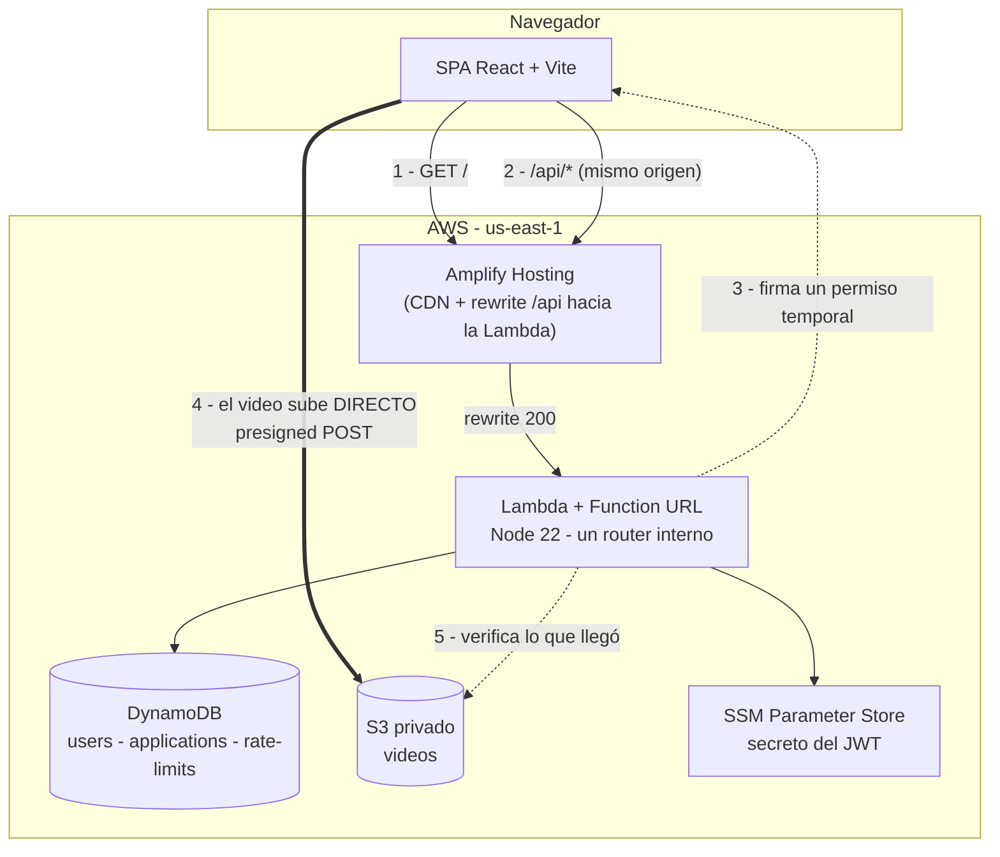

# Prueba técnica Full Stack - Educación Estrella

Flujo mínimo de originación de crédito educativo: registro e inicio de sesión, formulario de
solicitud con subida del video de la entrevista, y consulta de las solicitudes propias.

| | |
|---|---|
| **Aplicación desplegada** | https://main.dj0sqa3r34n40.amplifyapp.com |
| **Usuario de prueba** | `evaluador@estrella.test` / `Evaluador2026#Prueba` |
| **Región** | `us-east-1` |

---

## Índice

- [Arquitectura desplegada](#arquitectura-desplegada)
- [Estructura del repositorio](#estructura-del-repositorio)
- [Cómo levantar el proyecto localmente](#cómo-levantar-el-proyecto-localmente)
- [Cómo desplegarlo desde cero](#cómo-desplegarlo-desde-cero)
- [Decisiones técnicas](#decisiones-técnicas)
- [Seguridad](#seguridad)
- [Pruebas](#pruebas)
- [Consumo del AWS Free Tier](#consumo-del-aws-free-tier)
- [Limitaciones conocidas](#limitaciones-conocidas-y-qué-haría-distinto-con-más-tiempo)

---

## Arquitectura desplegada



### El recorrido de una solicitud

1. El navegador pide un **permiso de subida** a la API (`POST /api/uploads/presign`). El servidor
   genera una clave bajo el prefijo del usuario y firma una política de S3 con el tamaño máximo y
   el tipo permitido incrustados.
2. El navegador **sube el video directamente a S3**. El archivo nunca atraviesa el backend.
3. El navegador envía los datos del formulario (`POST /api/applications`). El servidor **verifica
   en S3** que el objeto existe, que pesa lo que debe y que sus primeros bytes son de un
   contenedor de video, y solo entonces registra la solicitud.

### Todo va por el mismo origen

El frontend llama a `/api/...` en relativo. Amplify tiene una regla de reescritura que reenvía
esas peticiones a la Function URL de la Lambda **por dentro**:

```json
[
  { "source": "/api/<*>", "status": "200",
    "target": "https://<function-url>.lambda-url.us-east-1.on.aws/<*>" },
  { "source": "/<*>", "status": "404-200", "target": "/index.html" }
]
```

En desarrollo, el `server.proxy` de Vite hace exactamente lo mismo, así que la cookie de sesión se
comporta igual en local y en producción. El porqué de esta decisión está en
[Estrategia de autenticación](#estrategia-de-autenticación).

---

## Estructura del repositorio

```
backend/            Lambda: una función, un router interno
  src/
    index.ts          punto de entrada y enrutado
    handlers/         un archivo por endpoint
    middleware/       verificación de la sesión
    repositories/     acceso a DynamoDB, aislado de los handlers
    schemas/          validación de servidor con Zod
    lib/              respuestas HTTP, JWT, contraseñas, clientes AWS
  template.yaml     infraestructura como código (SAM)

frontend/           SPA React + Vite, organizada por funcionalidad
  src/
    features/
      auth/           pantallas de sesión, contexto, esquemas
      applications/   formulario, tabla, subida
    components/ui/    shadcn/ui
    lib/              cliente HTTP y subidor con progreso
```

### Endpoints

| Método | Ruta | ¿Requiere sesión? | Qué hace |
|---|---|---|---|
| `GET` | `/health` | No | Comprobación de vida |
| `POST` | `/auth/register` | No | Crea la cuenta y abre sesión |
| `POST` | `/auth/login` | No | Abre sesión |
| `GET` | `/auth/me` | **Sí** | Devuelve la sesión actual |
| `POST` | `/auth/logout` | No | Borra la cookie |
| `POST` | `/uploads/presign` | **Sí** | Firma el permiso de subida a S3 |
| `POST` | `/applications` | **Sí** | Verifica el video y registra la solicitud |
| `GET` | `/applications` | **Sí** | Lista las solicitudes del usuario |

Los cuatro endpoints que requieren sesión devuelven **401** si la cookie falta o el token no es
válido. `/auth/logout` no la requiere a propósito: borrar una cookie que ya no sirve no debe fallar.

`/auth/login` y `/auth/register` pueden responder **429** con la cabecera `Retry-After` cuando se
supera el límite de intentos. Ver [Seguridad](#seguridad).

---

## Cómo levantar el proyecto localmente

### Requisitos

- Node 22 o superior
- AWS CLI v2 y SAM CLI, configurados con un perfil con permisos sobre la cuenta

### Backend

El backend **no se ejecuta en local**: el frontend apunta a la Lambda ya desplegada. Lo que sí se
hace en local es compilar, comprobar tipos y ejecutar las pruebas.

```bash
cd backend
npm install
npm run typecheck
npm test
```

### Frontend

```bash
cd frontend
npm install
cp .env.example .env.local     # y pon dentro la URL de tu Function URL
npm run dev
```

`API_PROXY_TARGET` es la única variable necesaria. La lee `vite.config.ts` para montar el proxy
que hace que `/api` sea del mismo origen; **nunca llega al navegador**. Su valor sale del output
`FunctionUrl` de `sam deploy`.

La aplicación queda en http://localhost:5173.

---

## Cómo desplegarlo desde cero

### 1. El secreto del JWT

CloudFormation no puede crear parámetros de tipo `SecureString`, así que se crea una sola vez a
mano y queda fuera del repositorio:

```bash
aws ssm put-parameter \
  --name "/estrella/jwt-secret" \
  --type SecureString \
  --value "<una cadena aleatoria larga>" \
  --region us-east-1
```

### 2. El backend y su infraestructura

```bash
cd backend
sam build
sam deploy --guided        # la primera vez; después basta con `sam deploy`
```

Parámetros de la plantilla:

| Parámetro | Para qué |
|---|---|
| `FrontendOrigin` | Origen del frontend desplegado, permitido en el CORS del bucket |
| `LocalOrigin` | Servidor de desarrollo, para poder probar subidas en local |
| `JwtSecretParameterName` | Nombre del parámetro SSM del paso 1 |

Al terminar imprime la `FunctionUrl`, el nombre del bucket y el de las tablas.

> **Nota.** En una actualización de stack, SAM reutiliza el valor anterior de los parámetros que no
> se pasan explícitamente. Un parámetro **nuevo** no tiene valor anterior, así que hay que pasarlo
> a mano la primera vez o el despliegue falla con un error de validación poco descriptivo.

### 3. El frontend

Amplify Hosting se conecta al repositorio desde la consola:

- Origen: GitHub, con la aplicación de Amplify autorizada solo sobre este repositorio
- Rama: `main`
- **Marcar "Mi aplicación es un Monorepo"** y poner `frontend` como directorio raíz
- Añadir la regla de reescritura de `/api/<*>` que aparece más arriba, **por encima** de la regla
  del SPA

Por qué Amplify no está en la plantilla de SAM: ver
[Infraestructura como código](#infraestructura-como-código).

---

## Decisiones técnicas

### Lambda con Function URL, en vez de contenedor

El tráfico de esta aplicación es esporádico: alguien entra, envía una solicitud y se va. Un
contenedor en ECS Fargate o App Runner **cobra por tiempo encendido**, lo use alguien o no. Lambda
cobra por invocación, y el volumen cabe holgadamente en su capa gratuita permanente.

Descarté **API Gateway** porque no necesito nada de lo que aporta (autorizadores, planes de uso,
etapas, enrutado complejo). Function URL tiene menos superficie de configuración y menos puntos de
fallo.

Esa elección arrastra una consecuencia: **una Function URL pertenece a una sola función**, así que
no puedo repartir la API entre varias Lambdas. De ahí que haya **una función con un router
interno** (un `switch` sobre método y ruta en `index.ts`). Beneficio añadido: un solo contenedor
caliente, un solo arranque en frío.

Lo que acepto a cambio: con `AuthType: NONE` no hay throttling gestionado ni WAF. Ver
[limitaciones](#limitaciones-conocidas-y-qué-haría-distinto-con-más-tiempo).

### Estrategia de autenticación

**JWT propio con `bcryptjs` y `jose`, en cookie `httpOnly`.**

Descarté **Cognito**: para correo y contraseña sin federación ni MFA, añade más configuración de la
que ahorra.

El token viaja en una cookie **`httpOnly`, `Secure`, `SameSite=Lax`**, no en `localStorage`, porque
`localStorage` lo lee cualquier script de la página y un XSS se llevaría la sesión.

**Y aquí está la decisión que más condiciona la arquitectura.** El frontend vive en
`*.amplifyapp.com` y la Lambda en `*.lambda-url.us-east-1.on.aws`: son **sitios distintos**, así que
la cookie sería de terceros. Safari las bloquea por defecto y Chrome las bloquea en incógnito, así que el
login habría fallado en silencio en el navegador de quien evalúe.

Opté por **eliminar el cruce de sitios** en vez de configurar CORS para permitirlo: la regla de
reescritura de Amplify hace que el navegador solo vea su propio dominio. Con eso:

- La cookie es **de primera parte**. El problema de Safari no se mitiga: **deja de existir**.
- **Desaparece CORS entre frontend y API.** No hay `Access-Control-Allow-Origin` que configurar, y
  por tanto ninguna excepción abierta a la política de mismo origen.
- Se puede usar `SameSite=Lax` en vez de `SameSite=None`, lo que **bloquea la cookie en peticiones
  POST cross-site**: protección CSRF gratis.

Lo verifiqué en local y en producción: el mismo identificador emitido por el servidor vuelve en la
petición siguiente, y `document.cookie` está vacío.

**Y lo comprobé en el navegador que motivó la decisión.** Safari en iPad: inicié sesión, cerré la
pestaña, volví a abrir la URL y la sesión seguía activa sin escribir la contraseña de nuevo. Es la
prueba de que Safari guarda la cookie y la reenvía, que es exactamente lo que no habría ocurrido si
fuera de terceros.

Asumo que **un JWT no se puede revocar** antes de que caduque. El cierre de sesión borra la cookie,
pero un token copiado seguiría siendo válido hasta expirar. Lo mitigo con una vida corta de una
hora.

### Política de contraseñas

Aquí hay dos normas que dicen cosas distintas, y elegí una a conciencia.

El **NIST 800-63B**, en su sección 5.1.1.2, **desaconseja** las reglas de composición. El motivo no
es ideológico, está medido en su apéndice A.3: obligar a mayúscula, número y símbolo no produce
contraseñas más difíciles, produce `Password1!`. La gente responde a esas reglas de forma
predecible. En la revisión de 2025 la redacción pasó de *should not* a *shall not*.

El **PCI DSS 4.0**, en cambio, **las exige**: su requisito 8.3.6 pide un mínimo de 12 caracteres con
letras y números para sistemas que manejan datos financieros.

Seguí PCI por tratarse de un producto de crédito. De ahí vienen la longitud mínima de 12 y la
exigencia de letras y números. **Pedir además mayúscula, minúscula y carácter especial no lo exige
ninguna de las dos normas: es decisión mía**, por ser lo esperable en el sector.

Y para tapar exactamente lo que el NIST señala, hay una **lista negra**. No es una lista de
contraseñas comunes al uso: `password` o `123456` ya las rechaza la longitud, así que incluirlas no
serviría de nada. Son 100 entradas que **cumplen toda la política y siguen siendo predecibles**, con
`Password123!` entre ellas. Sin esa lista, la política de composición tendría un agujero del tamaño
de su propia crítica.

La política vive en un único sitio, `PASSWORD_RULES`, y de esa misma lista salen la validación del
servidor y los requisitos que el formulario marca en vivo mientras se escribe. No pueden
desincronizarse.

### Estrategia de subida de archivos

**El video nunca atraviesa el backend.** Esto no lo elegí yo: **Lambda tiene un límite de 6 MB por
payload** y el archivo puede llegar a 200 MB. Físicamente no cabe.

El servidor firma un **presigned POST** y el navegador sube directo a S3.

**Por qué POST y no PUT:** una URL prefirmada de PUT **no puede limitar el tamaño del archivo**.
Solo la política de un POST admite `content-length-range`. Con PUT, cualquiera podría subir
gigabytes con una URL firmada para "un video".

La clave del objeto **la genera el servidor**, con el `userId` dentro
(`users/{userId}/{uuid}.mp4`), y se fija de forma exacta en la política. Si la eligiera el cliente,
podría escribir sobre el prefijo de otro usuario.

**Y después hay que comprobar qué llegó.** El `Content-Type` que devuelve `HeadObject` es el que
declaró el cliente al subir, así que no prueba nada: un archivo cualquiera declarado como
`video/mp4` pasa la condición del POST y `HeadObject` lo confirma como mp4. Por eso, antes de
registrar la solicitud, el servidor:

1. Comprueba que la clave empieza por el prefijo del usuario de la sesión
2. Lee con `HeadObject` el **tamaño real**
3. Descarga los **primeros 16 bytes** y comprueba los *magic bytes* del contenedor
   (`ftyp` en el byte 4 para MP4, `1A 45 DF A3` en el 0 para WebM)

En el navegador, el progreso se mide con **`XMLHttpRequest`**, no con `fetch`: **`fetch` no expone
progreso de subida en ningún navegador**, así que una barra construida sobre él sería falsa. `XHR`
aporta además `abort()`, que es lo que necesita el botón de cancelar.

### Elección de base de datos

**DynamoDB**, en modo de capacidad **aprovisionada**.

Los patrones de acceso son dos, y los dos son búsquedas por clave: *"el usuario con este correo"* y
*"las solicitudes de este usuario"*. No hay cruces ni consultas complejas que justifiquen SQL.

Descarté **RDS** porque obliga a VPC, subredes y grupos de seguridad, y a meter la Lambda dentro de
la VPC con el coste de arranque en frío que eso implica. También porque deja de ser gratuito a los doce
meses.

Elegí **aprovisionada y no on-demand** por una razón de cumplimiento, no de rendimiento: el carril
permanentemente gratuito de DynamoDB (25 RCU + 25 WCU) **solo aplica a capacidad aprovisionada**.
Con 5+5 por tabla y tres tablas, el proyecto usa 15 de 25.

**El diseño de claves es donde vive el aislamiento entre usuarios:**

```
users         PK = email                      (normalizado a minúsculas)
applications  PK = userId
              SK = {createdAt}#{applicationId}
rate-limits   PK = login#{email}               (TTL sobre resetAt)
```

- El correo **es** la clave de partición porque es la única forma de garantizar unicidad de forma
  atómica, con `ConditionExpression: attribute_not_exists(email)`. Un índice secundario global no
  es único, y comprobar antes de escribir tiene condición de carrera.
- Listar solicitudes es un `Query` con `PK = userId` tomado del token. **No hay `Scan` ni
  `FilterExpression`**, así que la consulta no puede devolver filas de otro usuario ni aunque
  hubiera un error en la capa de aplicación. El aislamiento es estructural.
- La clave de ordenación empieza por la fecha, así que el orden cronológico inverso sale gratis con
  `ScanIndexForward: false`.

### Infraestructura como código

SAM define la Lambda, su Function URL, las tres tablas, el bucket con su política y su CORS, los
roles IAM y el grupo de logs con retención.

**Amplify Hosting lo creé a mano, y es deliberado.** `AWS::Amplify::App` con repositorio conectado
exige un token de acceso de GitHub como propiedad del recurso, y versionar un token es exactamente
lo que no se debe hacer. Preferí una excepción documentada a un IaC completo con un secreto dentro.
La conexión OAuth desde la consola no deja ningún token en el repositorio.

### Validación duplicada entre cliente y servidor

Las reglas de validación están escritas **dos veces**: en `backend/src/schemas/` y en
`frontend/src/features/*/schemas.ts`.

Evalué extraerlas a un paquete compartido. El problema: una carpeta `shared/` sin `package.json` no
puede resolver sus propias dependencias (Node busca subiendo por el árbol y nunca llega al
`node_modules` del backend), así que compartir exigía **npm workspaces**.

Medido contra el alcance real (**tres archivos de esquemas, unas 60 líneas, un desarrollador, dos
días**), el riesgo de que se desincronicen era prácticamente nulo y la maquinaria costaba más de lo
que aportaba. Con un equipo o un horizonte más largo habría hecho lo contrario.

**La validación del cliente es una comodidad; la del servidor es la garantía.** El cliente valida
para dar respuesta inmediata sin viaje de ida y vuelta, pero todo lo que llega a la API se vuelve a
validar, porque cualquiera puede saltarse el frontend con `curl`.

---

## Seguridad

**Rutas protegidas.** Ocultar la interfaz es comodidad. La protección real es que **cada endpoint
que necesita sesión devuelve 401** si la cookie falta o el token no es válido. La verificación está
en un único sitio: `middleware/auth.ts`.

**El `userId` sale siempre del token, nunca del cuerpo de la petición.** Un `userId` inyectado en
el JSON lo descarta el esquema, y hay una prueba automatizada que lo comprueba.

**Verificación del JWT con el algoritmo fijado.** `jwtVerify` recibe `algorithms: ['HS256']`, lo
que rechaza por diseño un token que declare `"alg": "none"`. Hay pruebas para ese caso, para un
token manipulado, uno firmado con otro secreto y uno caducado.

**Fallo uniforme en el login.** Un correo inexistente y una contraseña incorrecta devuelven el
**mismo mensaje y tardan lo mismo**: cuando el correo no existe, la contraseña se compara contra un
hash señuelo. Sin eso, cronometrando las respuestas se podría averiguar qué correos están
registrados, que en una financiera revela quién ha solicitado un crédito.

**Bloqueo tras cinco intentos fallidos.** Cinco fallos sobre una misma cuenta y quedan quince
minutos de espera, con un 429 y su cabecera `Retry-After`. Se cuentan solo los fallos, así que quien
acierta la contraseña no gasta cupo, y **se cuentan exista o no la cuenta**: si solo contara las
reales, el 429 revelaría qué correos están registrados.

Iba a contar por IP, que es lo intuitivo, y **al probarlo descubrí que no sirve**. Amplify reenvía
`X-Forwarded-For` tal y como llega y no añade la IP real al final, así que la cabecera entera la
controla quien llama. Mandé una IP inventada con `curl` y el contador empezó de cero: un atacante se
salta ese límite cambiando un texto cada cinco intentos. Lo dejo escrito porque es el tipo de fallo
que solo aparece probando contra el despliegue real, no leyendo documentación.

Por eso el contador va **por cuenta**. El correo es justamente el dato que el atacante intenta
forzar, y cambiarlo es dejar de atacar esa cuenta. El coste que eso tiene está en las
[limitaciones](#limitaciones-conocidas-y-qué-haría-distinto-con-más-tiempo).

Si DynamoDB falla al consultar el contador, **se deja pasar**. Una avería del limitador no puede
tumbar el inicio de sesión de toda la aplicación, y debajo sigue estando la defensa que de verdad
frena la fuerza bruta: cada comprobación de contraseña cuesta unos 150 ms de bcrypt, y eso no
depende de esa tabla.

**Permisos IAM mínimos.** El rol de ejecución de la Lambda tiene exactamente las operaciones que
los handlers llaman, cada una sobre el ARN de su recurso. No hay `Scan`, ni `DeleteItem`, ni
`ListBucket`, ni un solo comodín.

**Bucket privado.** Block Public Access completo en sus cuatro banderas, `BucketOwnerEnforced` para
desactivar las ACL (así un presigned POST no puede hacer público un objeto ni queriendo), y
cifrado en reposo. Comprobado: un acceso anónimo devuelve 403.

**Secretos.** La clave de firma vive cifrada en SSM Parameter Store. La Lambda solo conoce el
**nombre** del parámetro, e IAM le concede `ssm:GetParameter` y `kms:Decrypt` sobre ese ARN
concreto. Descarté Secrets Manager porque cuesta 0,40 USD al mes por secreto y sale del Free Tier, y
uso la clave gestionada `aws/ssm` porque una clave propia son 1 USD al mes.

**No hay contraseña de base de datos que filtrar.** DynamoDB no usa credenciales: la autorización
es IAM sobre el rol de la Lambda. Es una clase entera de problema que no existe.

**Los logs no registran datos personales.** Solo identificador de petición, método y ruta. Nunca
cabeceras, cookies ni cuerpo, porque el cuerpo lleva el documento de identidad y la cookie lleva la
sesión.

---

## Pruebas

```bash
cd backend
npm test
```

Siete archivos, 62 casos. No busco cobertura: cada prueba defiende una decisión concreta que
podría romperse en silencio.

| Archivo | Qué cubre |
|---|---|
| `schemas/application.test.ts` | Validación de servidor: rangos del monto, enteros, caracteres del documento, video obligatorio, y que un `userId` inyectado se descarte |
| `schemas/auth.test.ts` | Normalización del correo y las seis reglas de la política de contraseñas, incluida la lista negra |
| `lib/video.test.ts` | Los *magic bytes* frente a texto, PNG, PDF, un ejecutable y archivos truncados |
| `handlers/presignUpload.test.ts` | Que el presign exija sesión, rechace tipo y tamaño **antes de firmar**, ponga el `userId` en la clave e imponga las condiciones de la política |
| `lib/jwt.test.ts` | Token manipulado, `alg: none`, otro secreto, caducado y basura |
| `lib/rateLimit.test.ts` | Que la ventana caduque por reloj y no por el borrado del TTL, y que un fallo de DynamoDB deje pasar en vez de cerrar el login |
| `lib/http.test.ts` | De dónde se toma la IP de quien llama y la forma de la respuesta 429 |

---

## Consumo del AWS Free Tier

Nada de lo desplegado genera cargo. Los límites se verificaron contra las páginas de precios de
AWS, no de memoria.

| Servicio | Límite | Permanente | Consumo |
|---|---|---|---|
| Lambda | 1 M peticiones + 400 000 GB-s / mes | Sí | < 0,1 % |
| DynamoDB | 25 GB + 25 RCU + 25 WCU | Sí *(solo en modo aprovisionado)* | 15/25 de capacidad |
| S3 | 5 GB + 20 000 GET + 2 000 PUT | 12 meses / créditos | Unos pocos videos |
| CloudWatch Logs | 5 GB combinados | Sí | < 1 %, con retención de 7 días |
| Transferencia saliente | 100 GB / mes | Sí | ~2 % |
| SSM Parameter Store | Parámetros estándar | Sí | 1 parámetro |
| Amplify Hosting | 1 000 min build + 15 GB servidos | **12 meses** | ~5 % de los builds |

**Decisiones que implicaban un cobro y no ejecuté:** Secrets Manager (0,40 USD/mes por secreto),
clave KMS propia (1 USD/mes), WAF (~5 USD/mes por Web ACL), RDS y NAT Gateway, DynamoDB on-demand
(sin carril gratuito de peticiones).

**Guardarraíles que puse:** retención de logs a 7 días (los grupos que crea Lambda por su cuenta no
caducan nunca), timeout de 10 s en la función, y presupuesto de gasto cero en AWS Budgets.

---

## Limitaciones conocidas y qué haría distinto con más tiempo

**Hay bloqueo por cuenta, pero no rate limiting de verdad.** Y la diferencia importa: rate limiting
es acotar cuántas peticiones puede hacer alguien por minuto, y para eso hace falta saber quién es
ese alguien sin que pueda mentir. Detrás del rewrite de Amplify esa identidad **no existe**, según
comprobé y está explicado en [Seguridad](#seguridad). No es un problema de código: es un límite de
la infraestructura gratuita.

La respuesta correcta es **AWS WAF con una regla basada en tasa**, que ve la IP real del visitante
en el borde, antes de que ninguna cabecera intervenga. Cuesta unos 5 USD al mes por Web ACL y por
eso no está. El cupo de concurrencia de la cuenta, 10 en una cuenta nueva, acota el daño de fondo.

El bloqueo por cuenta tiene además un coste que asumo a conciencia: **quien conozca un correo
registrado puede mantenerlo bloqueado** fallando a propósito cada quince minutos. Es una denegación
de servicio dirigida a una cuenta concreta. La OWASP desaconseja el bloqueo de cuenta a secas justo
por esto, y lo que recomienda alrededor (CAPTCHA tras varios fallos, retardos progresivos, segundo
factor) no cabía en el alcance. Lo acepté porque la alternativa era no tener ninguna protección y
porque la ventana es corta.

El límite del registro sí va por IP, y por lo tanto **se puede burlar con una cabecera falsa**. Lo
mantengo porque frena el uso torpe a coste cero, pero no lo presento como medida de seguridad.

**El JWT no se puede revocar antes de expirar.** El cierre de sesión borra la cookie del navegador,
pero un token copiado antes seguiría siendo válido hasta caducar. Lo mitigo con una vida de una
hora.

Evalué añadir una lista de denegación en DynamoDB y **decidí no hacerlo**: obligaría a consultar la
base de datos en cada petición autenticada, que es exactamente lo que un JWT evita. Si voy a pagar
esa consulta de todos modos, el token firmado deja de aportar nada frente a una tabla de sesiones,
que además sería más simple. El híbrido junta el coste de la base de datos con la complejidad del
token. Con más tiempo replantearía la pieza entera: o sesiones en base de datos, revocables por
diseño, o refresh token con rotación de vida corta.

**Una subida interrumpida deja el objeto huérfano en S3.** Elegí un diseño de una fase: subir
primero, registrar después. Si la red se corta entre ambos pasos, el video queda en el bucket sin
ninguna solicitud que lo reclame. Lo comprobé cortando el WiFi a mitad de una subida. Con más
tiempo crearía la solicitud en estado `PENDING_UPLOAD` y la confirmaría al final, o añadiría una
regla de ciclo de vida que expire los objetos no confirmados.

**Los magic bytes confirman el contenedor, no que el video sea reproducible.** Comprobarlo de
verdad exigiría transcodificación, explícitamente fuera de alcance.

**Amplify Hosting no está en IaC.** Lo expliqué más arriba: la alternativa era versionar un token
de GitHub. Con más tiempo lo movería a S3 + CloudFront definidos en la propia plantilla, que sí es
reproducible desde código.

**Los esquemas de validación están duplicados.** También explicado arriba. Con un equipo usaría npm
workspaces.

**No hay verificación de correo en el registro.** Las notificaciones están fuera de alcance. Con
más tiempo usaría SES con un token de un solo uso.

**Solo existe un estado de solicitud (`SUBMITTED`).** El flujo de aprobación está fuera de alcance.
Dejé el estado como campo del modelo, listo para una máquina de estados, pero sin transiciones.
